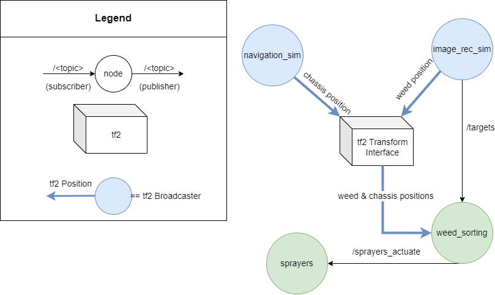
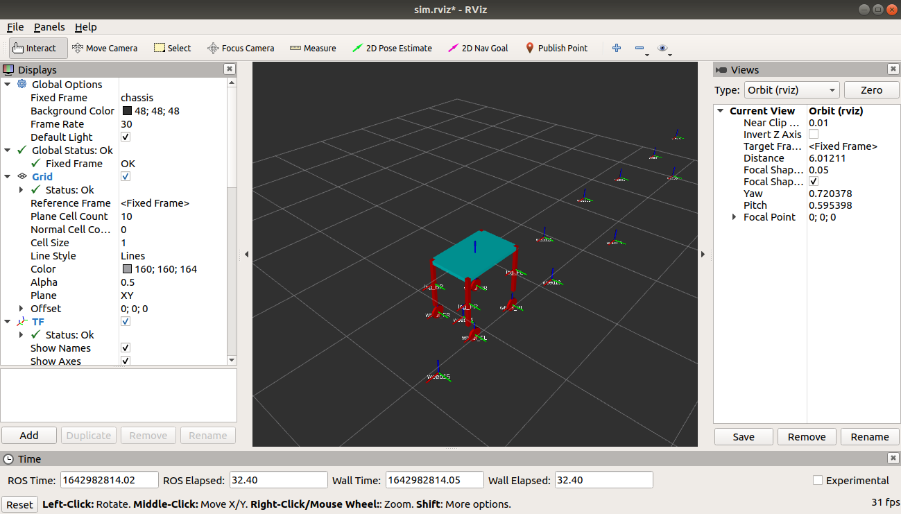

# Overall Control System
This is code for Overall Control in the Extermination subteam 

In this project, it contains:
* tf2 - a transform library in ROS used to keep track of the postion of the weeds in multiple coordinate frames over time
* a simulation of the navigation and image recognition teams to test code with

Here is a diagram for the ROS outline with all the nodes and topics: 



Frames and units conform to [REP 103](https://www.ros.org/reps/rep-0103.html):
* Frames are right-handed
* x is forwards, y is left, z is up
* Units are SI (ie. meters)

***

## TO USE

Launch control code with `roslaunch extermination_control extermination_control.launch`

Launch simulaiton code and visualizer with `roslaunch extermination_control sim_environment.launch`

*** 
# Node Summaries
## 1. weed_sorting 
Summary: 
* subscribes to /targets topic to listen for weed names (type: string)
* publishes a string to /sprayers_actuate topic to actuate specific sprayers
* LookupTransform of weed names received from /targets to pick the closest sprayer to actuate
* LookupTransform of chassis location to determine when to publish to /sprayers_actuate

## 2. sprayer
Summary:
* subscribes to /sprayers_actuate and receives 
* The index of the character array relates to its corresponding sprayer
* 0 - nothing, 1 - actuate for hard coded time
* example: "000010000" will result in the 4th indexed sprayer to actuate
* will need to be updated as sprayers are added / removed 

## 3. navigation_sim 
Summary: 
* broadcasts chassis location to tf2 interface 
* simulates a forward motion of 0.5 m/s

## 4. image_rec_sim
Summary:
* broadcasts weed static frames to tf2 interface
* publishes weed name to /targets
* simulates finding weeds from image rec with random positions ahead of the chassis
***

## Sample outputs

Run the extermination code with:

```roslaunch extermination_control extermination_control.launch```

and then, in a seperate terminal:

```roslaunch extermination_control sim_environment.launch```

Now, with our code running, you should see rviz open, looking like this:



If you run ```rqt_graph```, you should get this:


If you run ```rqt_console```, it should generate a pdf showing this:


Using LED's to Simulate Sprayer Actuation


